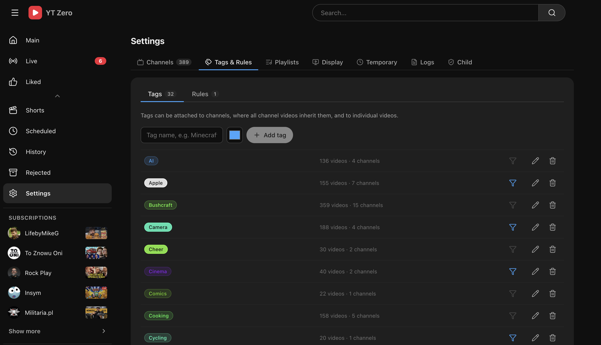
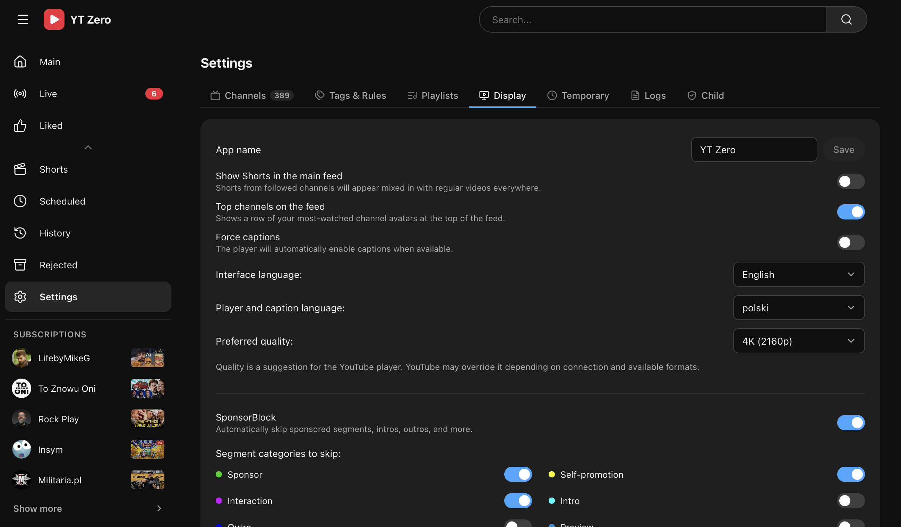

# YT Zero


| Standard player | Theater player |
| --- | --- |
|  |  |

| Tags and rules | Display settings |
| --- | --- |
|  |  |

> A self-hosted YouTube subscriptions reader with no Google account, no API key, and no recommendation algorithm.

YT Zero is a small web app for watching channels you already care about. It reads public YouTube RSS feeds, stores videos locally in SQLite, and gives you a quiet inbox for filtering, scheduling, watching, archiving, and organizing videos.

It keeps the parts that matter — your subscriptions, your own watch queue, your tags and playlists, an embedded player, local history and progress — and leaves out Google sign-in, API keys, recommendations, Shorts-first navigation, and algorithmic home feeds.

## Features

- **Subscription inbox** — all new videos from followed channels in one feed.
- **Channel import** — add channels manually, import OPML, or import `subscriptions.csv` from Google Takeout.
- **Live and upcoming streams** — dedicated live view with automatic status refresh.
- **Watch later buckets** — schedule videos for Today, Tonight, Tomorrow, Tomorrow evening, or Weekend.
- **Archive flow** — reject videos, restore them later, and keep the main feed clean.
- **History and progress** — record watched videos and resume partially watched ones.
- **Tags & rules** — tag videos and channels (inherited by videos), with automatic tag and filter rules.
- **User playlists** — local playlists with icons, manual additions, and rules.
- **Profiles** — multiple isolated profiles on one install, each with its own state.
- **Authentication** — None, shared login, per-profile login, OIDC, or proxy headers — with password and passkey support.
- **Child lock** — PIN-protect settings; useful for kids.
- **Shorts tab & player** — a followed-channels-only Shorts feed and a full-screen vertical player.
- **SponsorBlock** — optionally skip sponsored segments, intros, outros, and more.
- **Theater view, captions, quality, and display customization** — make the app yours.
- **Internationalization** — English, Polish, and German UI.

See the full list with screens in the **[Features](https://github.com/Pelski/ytzero/wiki/Features)** wiki page.

## Quick start

Run with Docker using the published GHCR image:

```yaml
services:
  ytzero:
    image: ghcr.io/pelski/ytzero:latest
    container_name: ytzero
    ports:
      - "3001:3001"
    volumes:
      - ./data:/data
    restart: unless-stopped
```

```bash
docker compose up -d
```

Open <http://localhost:3001>. The app starts empty — add channels from **Settings → Channels**.

Full instructions (local development, scripts, production-like start) are in **[Installation](https://github.com/Pelski/ytzero/wiki/Installation)**.

## Documentation

Full documentation lives in the **[Wiki](https://github.com/Pelski/ytzero/wiki)**:

- **[Installation](https://github.com/Pelski/ytzero/wiki/Installation)** — Docker, local dev, and scripts.
- **[Configuration](https://github.com/Pelski/ytzero/wiki/Configuration)** — environment variables.
- **[Features](https://github.com/Pelski/ytzero/wiki/Features)** — everything the app does, with screens.
- **[Importing Subscriptions](https://github.com/Pelski/ytzero/wiki/Importing-Subscriptions)** — OPML and Google Takeout.
- **[Profiles](https://github.com/Pelski/ytzero/wiki/Profiles)** — multi-account profiles.
- **[Authentication](https://github.com/Pelski/ytzero/wiki/Authentication)** — login methods and setup.
- **[Child Lock](https://github.com/Pelski/ytzero/wiki/Child-Lock)** — PIN-protecting settings.
- **[Backup & Updates](https://github.com/Pelski/ytzero/wiki/Backup-and-Updates)** — keeping your data safe.
- **[How It Works](https://github.com/Pelski/ytzero/wiki/How-It-Works)** — what is fetched and stored.
- **[Development](https://github.com/Pelski/ytzero/wiki/Development)** — tech stack and repository layout.

## Tech stack

| Layer | Stack |
| --- | --- |
| Backend | Bun, Hono, `bun:sqlite` |
| Frontend | React, Vite, TypeScript |
| Storage | SQLite |
| Runtime | Docker or local Bun |

## Privacy & license

YT Zero does not require a Google account or a YouTube Data API key, and stores app data locally in SQLite. It still connects to YouTube to fetch RSS feeds, metadata, thumbnails, pages, and embedded videos.

YouTube is a trademark of Google LLC. This project is not affiliated with, endorsed by, or associated with YouTube or Google LLC.

Licensed under the **GNU Affero General Public License v3.0 only** (`AGPL-3.0-only`). See [LICENSE](LICENSE). More in **[Privacy & License](https://github.com/Pelski/ytzero/wiki/Privacy-and-License)**.
